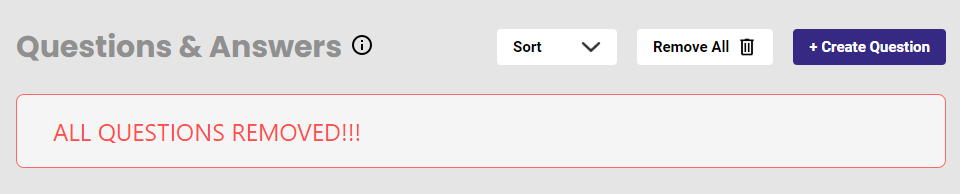

# Simple Implementation of Question and Answers App

Front End responsive single page application oriented to display and create Question and Answers designed in accordance with User Experience principles.

## Table of Contents

- [Technologies used](#technologies-used)
- [Testing](#testing)
- [Project Structure](#project-structure)
- [Available Scripts](#available-scripts)
- [Functionality](#functionality)
- [Todo](#todo)

## Technologies used

- [React](https://reactjs.org/) single page application - 18.2.0
- State management via [Redux Tool Kit](https://redux-toolkit.js.org/) - 1.8.5
- [Typescript](https://www.typescriptlang.org/) - 4.8.2
- HTML & CSS

## Testing

The testing strategy for this project is based on the following two libraries:

* [react-testing-library](https://github.com/kentcdodds/react-testing-library): these are some testing utilities that allow you to write tests that work with actual DOM nodes. You can think of it as a replacement of the popular [Enzyme](https://github.com/airbnb/enzyme) testing library.
* [Jest](https://jestjs.io/): test runner developed by Facebook, it ships with `create-react-app`. It is also used to mock some of the modules that are required on the tests.

## Project Structure

The project mainly consists of two folders
 - public : which contains the index.html file and all the common assets, like images,icons,screenshots
 - src: contains the main business logic codes and the structure is as shown below.

 

  - mocks : contain the files needed for jest library for mocking css.
  - app: contains the store and hooks
  - common: folder is used for keeping common components, utilities which can be re-used for different features.
   - all reusable components are kept inside the components folder and respective unit test files are present.
  - features: folder consisits of the main feature component. The component consist of the Slice file, the component file, the functional unit test case file and the css file.

The css for feature component consists all the styling for common components as its is a small application. For Bigger application it is recommended to keep the css separate with the components.

Other root files like App.tsx, index.tsx are kept inside the src folder.

## Available Scripts

In the project directory, you can run:

### `npm install`

To install all the dependencies.This should be the first step post cloning the repositary.

### `npm start`

Runs the app in the development mode.\
Open [http://localhost:3000](http://localhost:3000) to view it in the browser.

The page will reload if you make edits.\
You will also see any lint errors in the console.

### `npm run test`

Triggers the complete test suite of the application created using react-testing-library

### `npm run build`

Builds the app for production to the `build` folder.\
It correctly bundles React in production mode and optimizes the build for the best performance.

The build is minified and the filenames include the hashes.\
Your app is ready to be deployed!

## Functionality

- On landing on the application home page, we can see 3 main sections - header,aside,main
    - Header : displays the application header "Awesome Q/A Tool"
    - Aside : displays a string which dynamically shows the available count of questions
    - Main : the business area of the app, having all the functionalities.

### Main
 
The main functional component of the application consists of below sections.

- Header "Questions & Answers" with tool tip attached.
- 3 buttons - sort, remove all, create application
  - sort : clicking on this sorts all the questions in alphabetical order.
  - remove all : clears all the questions created and displays an Alert.

  

  - +Create Question : triggers a popup containing the form to type the question and answer. On confirmation we can click the create button to add the new question answer to main page.
  
  

  The pop-up contains a check box which will add 5 second delay in adding the question to the main page.

  If either question or answer or both are empty, clicking on Create button will throw an error, preventing empty question/answer from being saved.

- The main view displaying the added Question and Answer List. Each component consist of an edit icon and a delete icon respectively. 

Only the Question is displayec by default , on clicking on the question , answer is displayed. assumption made that more than one question/answer pair can be kept open at a point of time.

Clicking on the Edit button opens up a pop-up where the Question and Answer are prepopulated and can be edited and saved. If kept empty ,error is displayed.

Similarly clicking on delete button opens up a prompt which ask for confirmation of deletion of Question and Answer.

The page is designed taking into consideration of responsiveness. The application is compatible both in mobile as well as tab screens.

### Mobile Screen

  
### IPad Screen

## TODO

- Implement a generic reusable modal for all the modal components.